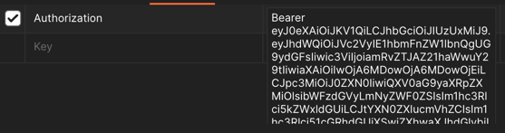
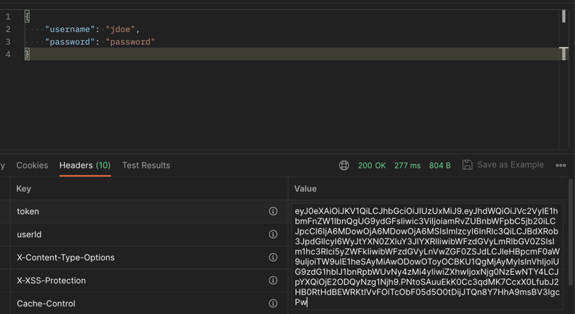

## Java-Challenge

- I fixed a few bugs and added a user endpoint for registration. 
- Most routes are now protected(I'm using Spring Security), so you have to login with a user to use the employee endpoints.
- When the application is started, this user is created: `Username: jdoe email: jdoe@gmail.com password: password`
  - You can also make a user by using this endpoint `http://localhost:8080/api/v1/users/register`, you just need to give a username, email and password
- I made filters and listeners for the application.
- I also created mappers for the entities and DTOs.
- User accounts will be locked after too many failed login attempts.
- I created permissions and permission annotations.
- When a user is logged in they are provided a JWT.
- I added more robust exception handling.
- Public Endpoints:
```
/api/v1/users/login
/api/v1/users/register
/v2/api-docs,/actuator/**
/swagger-ui.html
/webjars/**
/swagger-resources/**
```
Unprotected URLs:
```
POST http://localhost:8080/api/v1/users/login
Payload Example:
{
    "username": "jdoe",
    "password": "password"
}

POST http://localhost:8080/api/v1/users/register
Payload Example:
{
    "username": "jdoe2",
    "email": "jdoe2@gmail.com",
    "password": "password"
}

Swagger UI:
http://localhost:8080/swagger-ui.html

H2 Console:
http://localhost:8080/h2-console
JDBC URL: jdbc:h2:mem:testdb
username: sa
no password
```
Protected URLs:
```
GET http://localhost:8080/api/v1/employees
GET http://localhost:8080/api/v1/employees/{id}
GET http://localhost:8080/api/v1/users/logout

POST http://localhost:8080/api/v1/employees
Payload Example:
{
    "name": "test",
    "salary": 1000,
    "department": "IT"
}

PUT http://localhost:8080/api/v1/employees/{id}
Payload Example:
{
    "name": "John",
    "salary": 12000,
    "department": "IT"
}

DELETE http://localhost:8080/api/v1/employees/{id}
```
---
Protected endpoints require an Authorization header. You must provide the 'Bearer' prefix and a token(you get this token in the headers when you login)

---

Login Headers:

---
## About Me
- I'm certified in Java 8:
  - https://www.credly.com/badges/e9a8571c-0412-446b-ab76-98b448bfe368/public_url
- I'm certified in Spring:
  - https://www.credly.com/badges/afbe1bc7-70e3-43f9-9518-03b09b1c80a5?source=linked_in_profile
- I have been using Java and Spring for 3 years.
- Here's the link to my linked in profile:
  - https://www.linkedin.com/in/dayvon-a-5b19ab144/
---